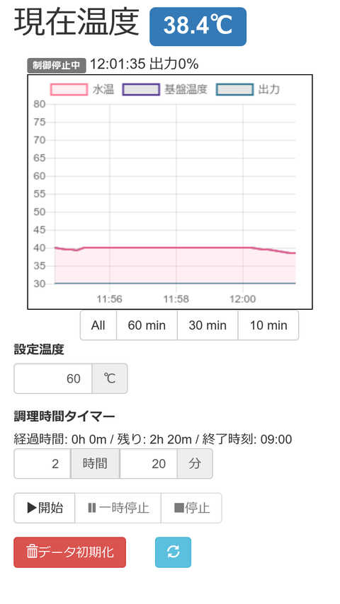

Generic Anova 基板側ソフトウェア
==================================

- 温度制御
- Web UI



使用方法
---------

frontendのビルドが必要。staticディレクトリに生成

```
$ cd web
$ npm install
$ npm run build
```

server側の依存モジュールインストール

```
$ python setup.py 
```

設定ファイル編集

```
$ cp ganova.conf.sample ganova.conf
# ganova.confを環境に合わせて編集
```

サーバー起動

```
$ ganova
```


サーバ側API
----

- PUT /api/index
    初期表示用API（全データ取得）
- GET /api/pid
    温度制御用設定値の取得
- PUT /api/pid
    温度制御用設定値の更新
- SSE /sse
    温度変化イベント Server Sent Event
- DELETE /api/temperature
    温度データの履歴削除
- GET /api/setting
    動作確認用 PID制御用係数の更新・取得


